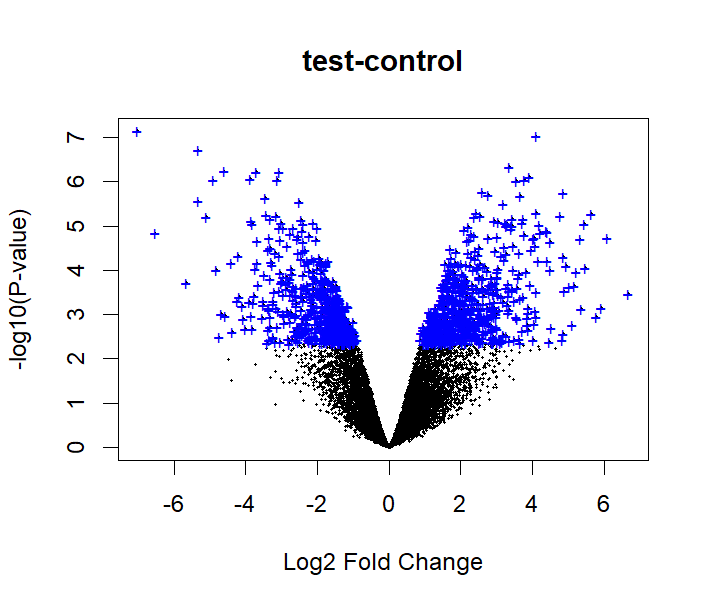

# Gene Expression Analysis on Microarray Data
Differential gene expression analysis using R on GEO data to identify highly dysregulated genes between case and control samples.
This project reproduces and explores a differential gene expression analysis workflow provided in the Gene Expression Omnibus.
This project involves the analysis of gene expression data retrieved from the NCBI Gene Expression Omnibus (GEO) database using R.  
The main objective was to identify significantly dysregulated genes between case and control samples in a selected dataset.  
By applying statistical and visualization approaches (such as volcano plots and heatmaps), this analysis highlights potential biomarkers or molecular signatures associated with the studied condition.

# Dataset used:
- GEO accession: GSE10500
- Gene expression in rheumatoid arthritis synovial macrophages
- retrieved from GEO database (NCBI)
- https://www.ncbi.nlm.nih.gov/geo/query/acc.cgi?acc=GSE10500
- PMID: 18345002

# Key Tools and Packages:
- R (limma, GEOquery,Biobase, ggplot2, maptools, clusterProfiler)
- GEO database (NCBI)
- Differential expression and visualization techniques

# Objectives:
Selected a case vs. control dataset from GEO.
- Ran the GEO-provided R pipeline locally in RStudio
- Retrieve and preprocess GEO dataset  
- Identify up- and down-regulated genes 
Understood and visualized each step of the analysis, including:
- Data normalization
- Differential expression (using limma/DESeq2)
- Interpreted the most dysregulated genes between case and control groups
- biological processes (GO) and pathways (KEGG) enrichement analysis
- Visualize significant results through plots

# Original Code Source
The base R script was provided by GEO as part of their analysis tools. All interpretations, visualizations, and explanations are my own.
Reproduced and explored GEO differential expression workflow to understand the computational steps behind microarray/RNA-seq analysis.
This project reflects my growing expertise in bioinformatics, data analysis, and molecular interpretation using real-world genomic datasets.

# Author
Reproduced, documented, and interpreted by Amina Ayub.

# References	
Yarilina A, Park-Min KH, Antoniv T, Hu X et al. TNF activates an IRF1-dependent autocrine loop leading to sustained expression of chemokines and STAT1-dependent type I interferon-response genes. Nat Immunol 2008 Apr;9(4):378-87. PMID: 18345002.

Ritchie, M. E., Phipson, B., Wu, D. I., Hu, Y., Law, C. W., Shi, W., & Smyth, G. K. (2015). limma powers differential expression analyses for RNA-sequencing and microarray studies. Nucleic acids research, 43(7), e47-e47.

Davis, S., & Meltzer, P. S. (2007). GEOquery: a bridge between the Gene Expression Omnibus (GEO) and BioConductor. Bioinformatics, 23(14), 1846-1847.
